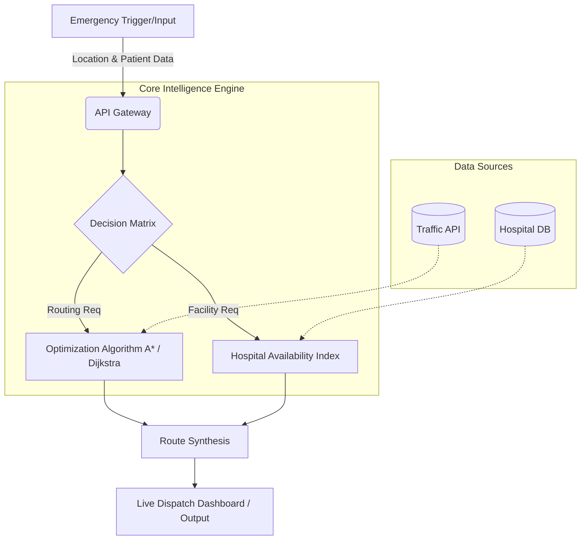

<!-- Banner Image Suggestion: A sleek, dark-mode futuristic map with glowing neon emergency routes, overlaying a high-tech hospital UI dashboard. (E.g. ``) -->

# 🚑 MedRoute AI

**Intelligent Emergency Route Optimization & Hospital Recommendation System**

[Overview](#-overview) •
[Features](#-key-features) •
[Architecture](#-system-architecture) •
[Intelligence](#-core-intelligence)

 

## ⚡ Overview: The Critical Seconds

In emergency medical scenarios, time is the ultimate currency. MedRoute AI bridges the gap between chaotic real-world traffic patterns and hospital readiness, ensuring critical patients reach the right care facility via the fastest possible route.

| ❌ The Problem | ✨ The MedRoute Solution |
| :--- | :--- |
| **Blind Routing:** Ambulances rely on standard GPS, unaware of dynamic blockages or micro-delays. | **Smart Pathing:** Predicts and calculates the absolute fastest emergency corridor in real-time. |
| **Facility Overload:** Patients arrive at hospitals lacking specific resources or available beds. | **Intelligent Matching:** Recommends destinations based on real-time hospital capacity and patient needs. |
| **Human Error:** High-stress manual dispatching leads to sub-optimal decisions. | **Algorithmic Precision:** Instantaneous, data-driven decisions devoid of cognitive overload. |

 

## 🧠 Key Features

<table>
  <tr>
    <td>
      <h3>🏎️ Dynamic Smart Routing</h3>
      
Continuous calculation of optimal emergency paths, factoring in real-time constraints, historical traffic density, and priority corridor access.

    </td>
    <td>
      <h3>🏥 Predictive Hospital Matching</h3>
      
Scores and recommends destination facilities based on current ER load, specific medical department availability, and proximity.

    </td>
  </tr>
  <tr>
    <td>
      <h3>⚡ Real-Time Decision Logic</h3>
      
Instantly reroutes units when anomalies (accidents, closures) are detected, ensuring zero latency in critical pathing.

    </td>
    <td>
      <h3>📊 Response Analytics</h3>
      
Post-event telemetry and dispatch performance tracking to continuously refine algorithms and improve response metrics.

    </td>
  </tr>
</table>

 

## 🏗️ System Architecture

 

## 🔄 Execution Pipeline

> **1. Ingestion** ➔ Coordinates and trauma type received. 
> **2. Analysis** ➔ AI evaluates local hospitals for capability and capacity. 
> **3. Computation** ➔ Graph algorithms (A*/Dijkstra) compute micro-optimized routes. 
> **4. Deployment** ➔ Live route and destination telemetry pushed to the active unit. 

 

## 🛠️ Technology Stack

| Domain | Technologies |
| :--- | :--- |
| **Core Logic** | `Python` `C++` (for high-perf routing) |
| **Algorithms** | `A* Search` `Dijkstra's` `Graph Theory` |
| **Data & APIs** | `RESTful APIs` `GeoJSON` `PostGIS` |
| **Processing** | `Pandas` `NumPy` `NetworkX` |

 

## 🧪 Core Intelligence

MedRoute AI does not rely on static maps. It builds a weighted graph of the urban environment where nodes are intersections and edges are road segments. 

* **Weight Calculation:** Edge weights are dynamically adjusted based on real-time traffic density, road type, and time of day.
* **Pathfinding (A* / Dijkstra):** The system deploys optimized heuristic search algorithms to find the shortest path cost across the weighted graph, ensuring computation completes in milliseconds.
* **Matching Heuristic:** Hospital selection uses a custom scoring formula: `Score = (W1 * Proximity) + (W2 * Bed Availability) + (W3 * Specialty Match)`.

 

## 📊 Impact

* **Reduced Transit Time:** Shaving minutes off critical transit windows.
* **Optimized ER Load:** Distributing emergency load evenly across regional medical infrastructure to prevent localized bottlenecks.
* **Data-Driven Triage:** Removing guesswork from emergency response dispatching.

 

## 🚀 Future Scope

* **V2X Integration:** Vehicle-to-Everything communication for preemptive traffic light control (Green Wave).
* **Predictive AI Modeling:** Utilizing ML to forecast accident hotspots and pre-position emergency assets.
* **Live IoT Telemetry:** Direct integration with onboard ambulance vitals monitors to update hospitals en route.

 

---

  
**Built for the future of emergency response.**

